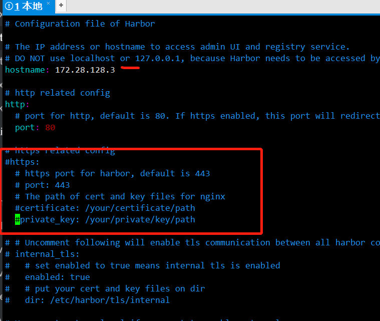
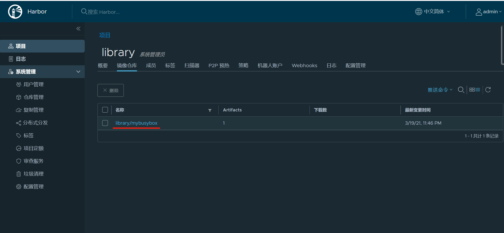

# 安装harbor docker镜像仓库

准备好docker环境.

## 安装docker compose

```
sudo curl -L "https://github.com/docker/compose/releases/download/1.28.5/docker-compose-$(uname -s)-$(uname -m)" -o /usr/local/bin/docker-compose

sudo chmod +x /usr/local/bin/docker-compose

sudo ln -s /usr/local/bin/docker-compose /usr/bin/docker-compose
```

## 下载harbor

https://github.com/goharbor/harbor/releases

解压

```
tar zxf *.tgz
```

进入目录

```
cp harbor.yml.tmpl harbor.yml
```

编辑文件 harbor.yml. 

hostname改成本机ip, 然后注释https配置



执行安装

```
sudo ./install.sh
```


## 镜像推送

编辑  /etc/docker/daemon.json, 添加.

```
{
  "registry-mirrors": ["https://9cpn8tt6.mirror.aliyuncs.com"],
  "insecure-registries" : ["172.28.128.3:80", "0.0.0.0/0"]
}

```

重启docker 和 harbor

```
systemctl restart docker

docker-compose down -v
docker-compose up -d
```

登录

```
 docker login -uadmin -pHarbor12345 172.28.128.3
```

上传镜像

```
docker pull busybox
docker tag busybox:latest 172.28.128.3:80/library/mybusybox:latest
docker push 172.28.128.3:80/library/mybusybox:latest
```



## 参考

[官网安装教程](https://goharbor.io/docs/2.0.0/install-config/)

