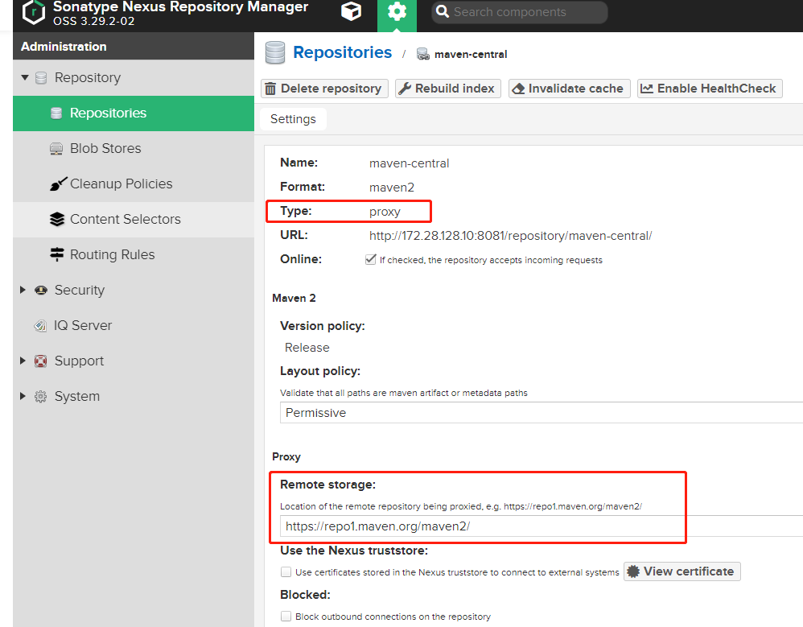
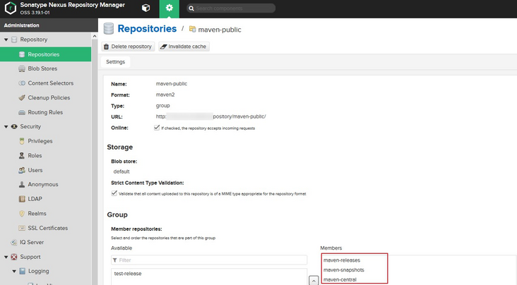
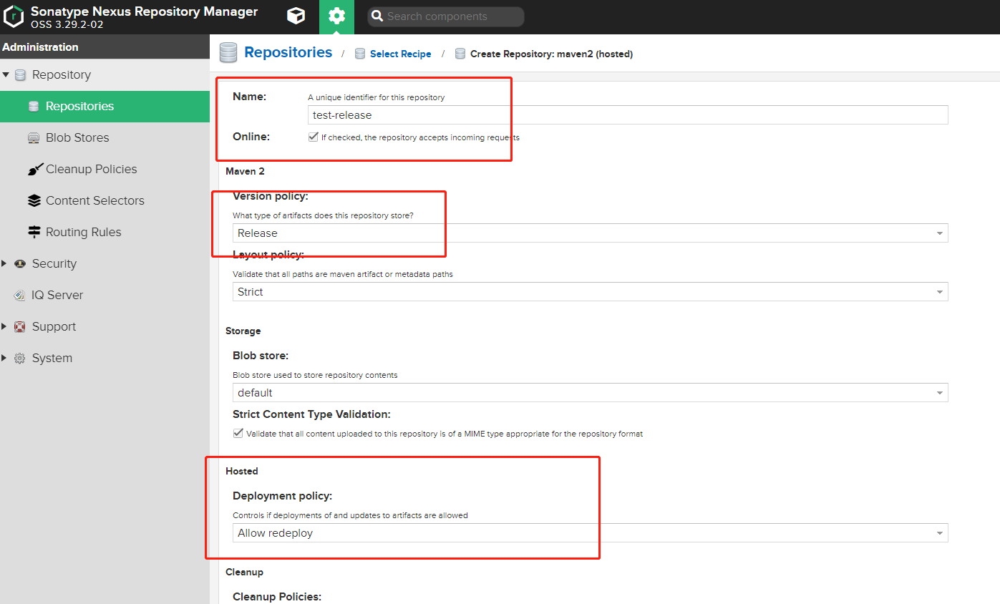
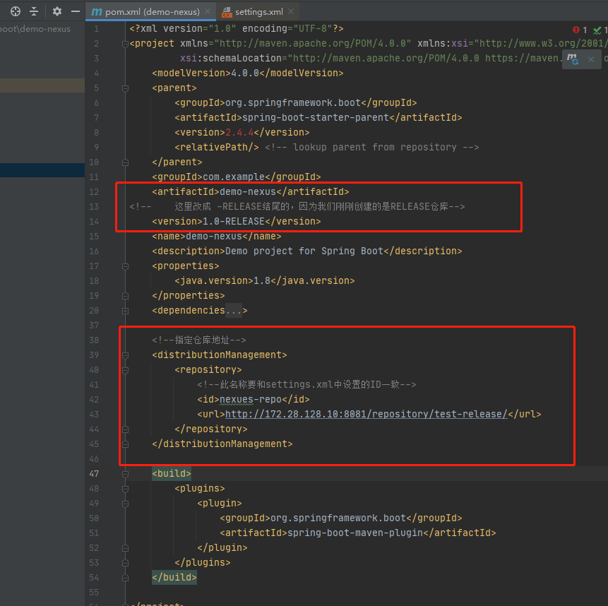
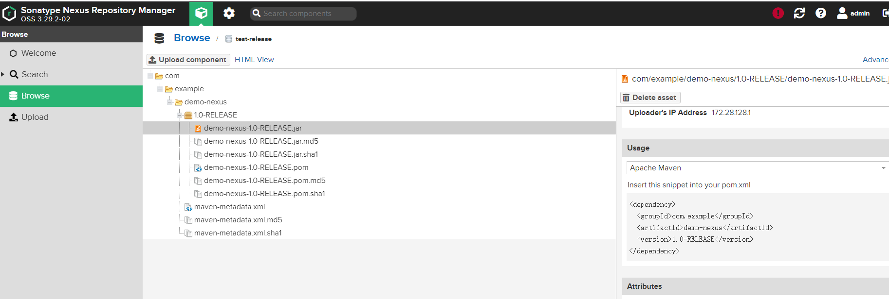
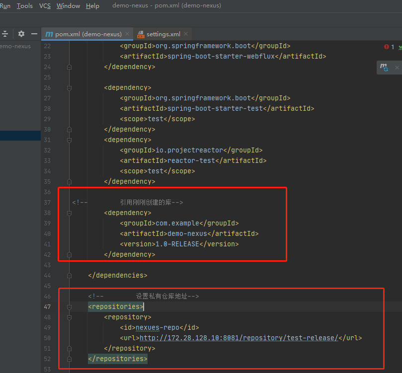

# Docker部署nexus3私有仓库

> 本教程通过Docker部署Nexus3私有仓库,并演示包上传私有仓库 与 引用依赖上传的包.


## 前置准备

docker环境

## 安装nexus3

```shell
sudo docker run -d --name nexus3 --restart=always \
    -p 8081:8081 \
    -e INSTALL4J_ADD_VM_PARAMS="-Xms1g -Xmx1g -XX:MaxDirectMemorySize=2g" \
    --mount src=nexus-data,target=/nexus-data \
    sonatype/nexus3
```

> --mount src=nexus-data,target=/nexus-data    表明使用数据卷存储数据. 这里建议不要使用-v挂载的方式. 参考: https://www.xubaojin.com/post/317.html
>
> -e INSTALL4J_ADD_VM_PARAMS=   根据系统承载能力设置
>
> 其他设置参考 [nexus3安装文档](https://registry.hub.docker.com/r/sonatype/nexus3#user-content-persistent-data)


查看日志

```shell
sudo docker logs -f nexus3
```

提示如下表示启动成功

```
-------------------------------------------------

Started Sonatype Nexus OSS 3.29.2-02

-------------------------------------------------

```

浏览器进入 http://172.28.128.10:8081/  (注意ip替换成你的)

查看admin密码并登录

```
docker exec -it nexus3 cat /nexus-data/admin.password
```


## nexus仓库类型简介


可以看到默认情况下Nexus会帮我们创建了几个仓库，仔细观察红色框住的地方，里面有几种仓库的类型，解释如下：

- proxy 远程仓库的代理，比如说nexus配置了一个central repository的proxy,当用户向这个proxy请求一个artifact的时候，会现在本地查找，如果找不到，则会从远程仓库下载，然后返回给用户。
- hosted 宿主仓库，用户可以把自己的一些仓库deploy到这个仓库中
- group 仓库组，是nexus特有的概念，目的是将多个仓库整合，对用户暴露统一的地址，这样就不需要配置多个仓库地址。


下面我们仔细看一下里面的一些仓库，点击maven-central仓库:



把Proxy改成阿里云镜像地址 https://maven.aliyun.com/repository/public


进入maven-public查看

可以看到这是一个group类型的仓库，里面包含了maven-releases/maven-snapshots/maven-central仓库，意思是我们只需要在本地添加这个仓库，则可以依赖到上述3个仓库中的库了。


## 本地代码上传nexus仓库

创建一个**hosted**类型的仓库.  Version policy根据需要选择,  Deployment policy 一般选择 Allow redeploy



修改maven的settings.xml文件, 添加仓库账号密码

```xml
  <servers>
      <!-- 指定私库的账号密码 -->
      <server>
          <id>nexues-repo</id>
          <username>admin</username>
          <password>123456</password>
      </server>
  </servers>
```

修改demo项目的pom文件，添加仓库配置.

url改成上面创建的库url.

id注意要和settings.xml设置的一致,否则deploy会报401错误.

```xml
<!--指定仓库地址-->
    <distributionManagement>
        <repository>
            <!--此名称要和settings.xml中设置的ID一致-->
            <id>nexues-repo</id>
            <url>http://172.28.128.10:8081/repository/test-release/</url>
        </repository>
    </distributionManagement>
```

改完后的pom文件



配置完成，idea 点击maven插件的deploy开始上传


上传完成后，进入nexus可查看上传的包。




## 引用依赖

这里我们演示引用我们刚刚上传的包.

POM的dependencies添加

```
        <dependency>
            <groupId>com.example</groupId>
            <artifactId>demo-nexus</artifactId>
            <version>1.0-RELEASE</version>
        </dependency>
```

POM的dependencies同级节点添加

```
    <repositories>
        <repository>
            <id>nexues-repo</id>
            <url>http://172.28.128.10:8081/repository/test-release/</url>
        </repository>
    </repositories>
```

添加完成如下




## 参考

[[Docker使用Nexus部署maven私有仓库](https://segmentfault.com/a/1190000020708330)](https://segmentfault.com/a/1190000020708330)


