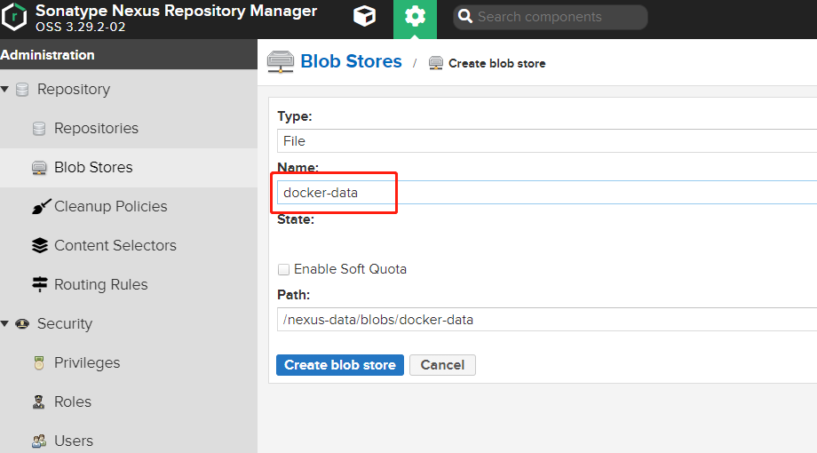
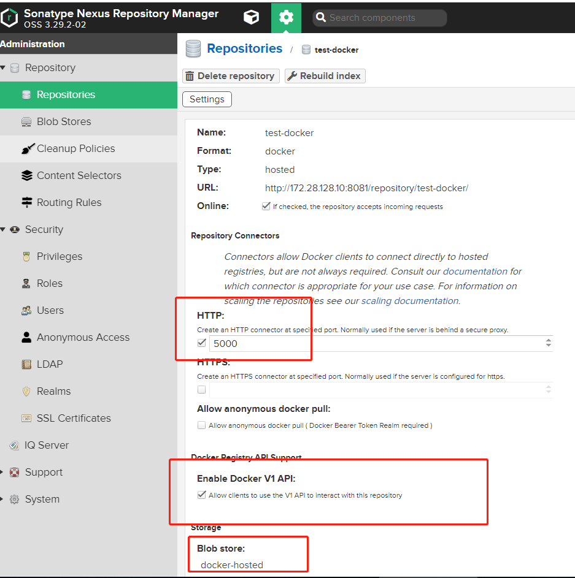
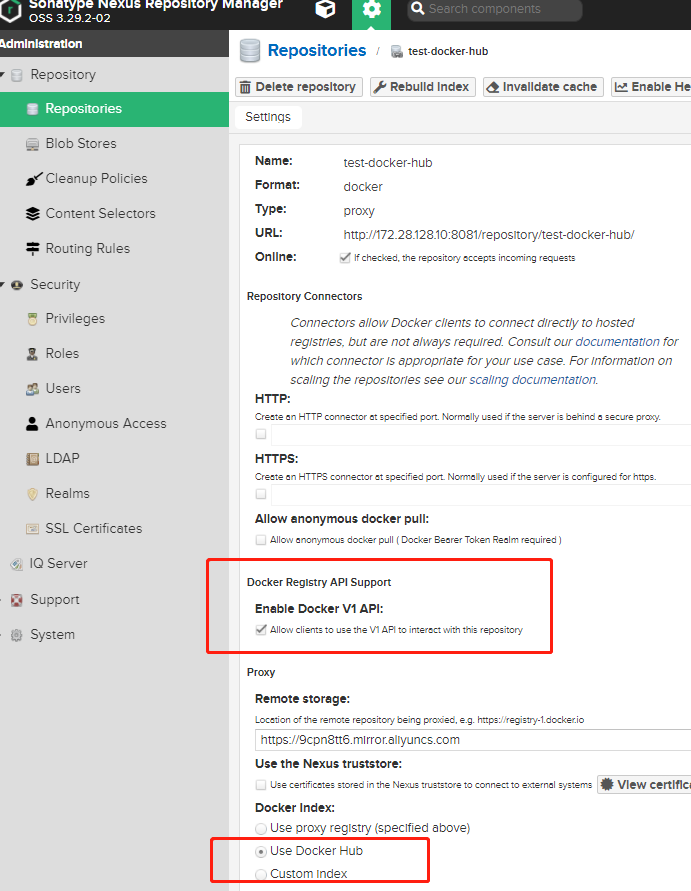
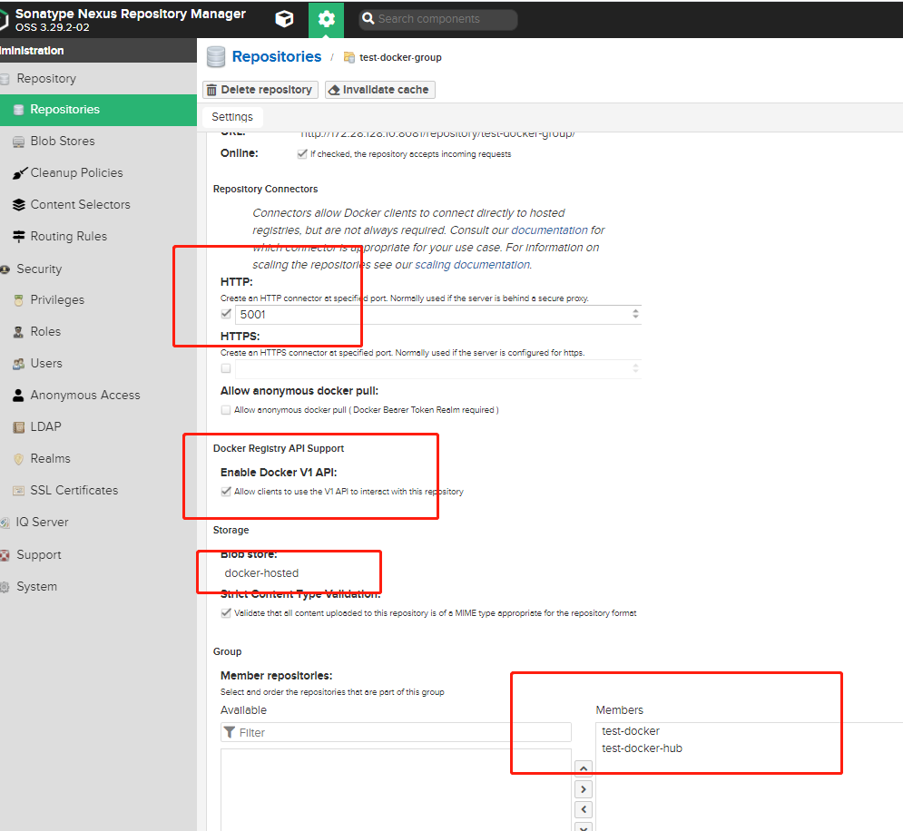

# Nexus3作为Docker镜像仓库


## docker启动nexus命令

```shell
sudo docker run -d --name nexus3 --restart=always \
    -p 8081:8081 \
    -p 5000:5000 \
    -p 5001:5001 \
    -e INSTALL4J_ADD_VM_PARAMS="-Xms1g -Xmx1g -XX:MaxDirectMemorySize=2g" \
    --mount src=nexus-data,target=/nexus-data \
    sonatype/nexus3
```

8081端口用于后台访问, 5000用于docker pull, 5001用于docker push.


nexus服务启动完毕后, 我们依次创建 :

Blob Stores : 用户镜像底层存储

docker hosted类型仓库 : 用户推送镜像库

docker proxy 类型仓库 : 本地库没有的话代理到指定仓库

docker group 类型仓库 : 用户镜像拉取. 


## 创建Blob Stores

创建一个 docker-data 存储供下面的 hosted\proxy\group 使用.



##  创建 docker hosted 仓库

创建hosted类型的仓库.  用于私有镜像推送存储. 

端口填入5000.  这样 docker客户端就可以使用**docker push <IP>:5000/<包名>:<TAG>**进行镜像推送.

Blob Store 选择上面创建的 docker-data.  (无视截图里面的docker-hosted)



## 创建 docker proxy 仓库

创建proxy类型的仓库.  当库在docker hosted 仓库没有的话,代理到指定的仓库(如下因为选择User Docker Hub, 所以会去docker hub上面拿库.).



## 创建 docker group 仓库

创建group类型的仓库.  指定5001端口. 选择Blob store为第一步创建的docker-data

Member repositorires 依次选择test-docker\test-docker-hub. 

这样当 docker 客户端 通过 **docker pull <ip>:5001/<依赖库>**  拉取库的时候, 会依次从 test-docker -> test-docker-hub 查找下载依赖库.



## 测试使用

在需要拉取镜像的docker客户端, 添加/etc/docker/daemon.json文件. ip为nexus服务ip.

```
{
  "registry-mirrors": ["https://registry.docker-cn.com"],
  "insecure-registries" : ["172.28.128.10:5000","172.28.128.10:5001"]
}

```

> 当配置TSL加密证书的话,可以不送设置 insecure-registries

重启doker

```
systemctl restart docker
```

推送镜像

```
docker login -uadmin -padmin123 172.28.128.10:5000
docker pull busybox
docker tag busybox:latest 172.28.128.10:5000/mybusybox:latest
docker push 172.28.128.10:5000/mybusybox:latest
```

拉取镜像

```
docker login -uadmin -padmin123 172.28.128.10:5001
docker pull 172.28.128.10:5001/mybusybox:latest
```


## 存在的问题

- nexus oss版本的(就是免费版本) 镜像推送跟镜像拉取分为两个端口, 当要拉取并推送的时候就比较麻烦. 

## 参考

[nexus3作为maven私服的使用](https://blog.csdn.net/wc1695040842/article/details/102575686)

[nexus3作为docker私服的使用](https://blog.csdn.net/wc1695040842/article/details/103926554)

