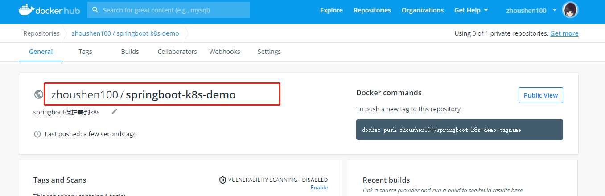

# 镜像推送到Docker Hub


## 注册Docker Hub账号

前往官网注册 https://hub.docker.com/


## 创建仓库

登录并创建一个仓库。




## Springboot镜像打包到本地Docker

创建Dockerfile文件,写入

```powershell
FROM openjdk:8-jdk-alpine
COPY demo-0.0.1-SNAPSHOT.jar app.jar
ENTRYPOINT ["java","-jar","/app.jar"]

```

> TIP:
>
> 选择 openjdk:<版本号>-alpine 格式的openjdk打包出来更小
>
> docker history <镜像名称>  可以查看打包层信息（每层干啥，每层大小。）


打包docker镜像, 其中 **zhoushen100/springboot-k8s-demo** 就是上面创建的仓库地址。 **1.0**自定义版本号。 命令最后的**.**表示当前目录下的Dockerfile

```shell
sudo docker build -t zhoushen100/springboot-k8s-demo:1.0 .
```


## 镜像推送到Docker Hub

首先登陆docker hub

```shell
docker login
#输入账号密码
```

推送到仓库

```shell
docker push
```

