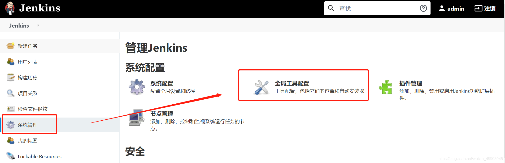
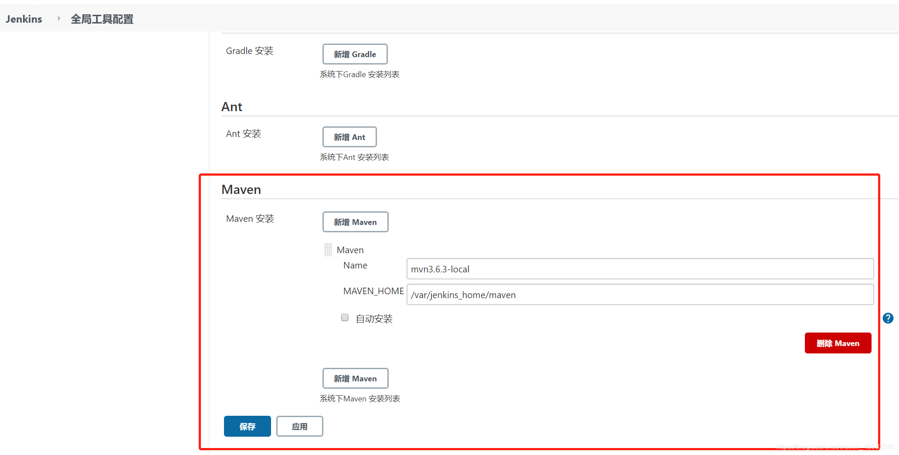
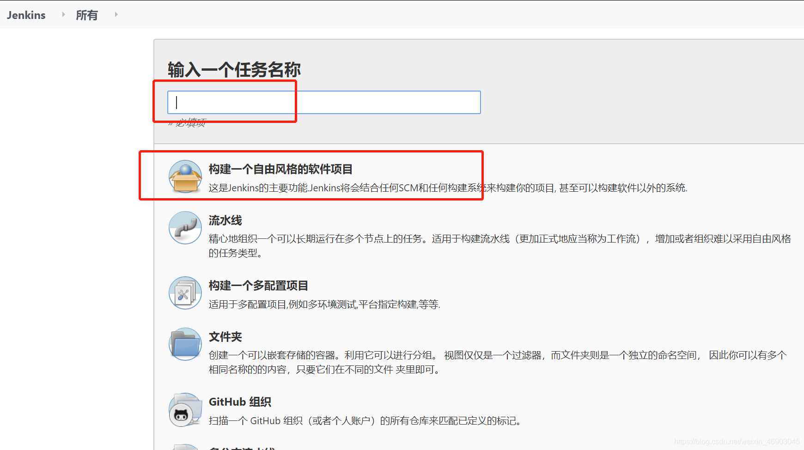
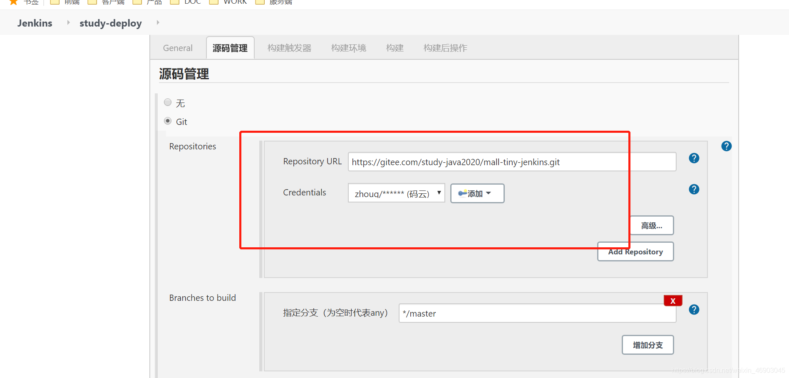
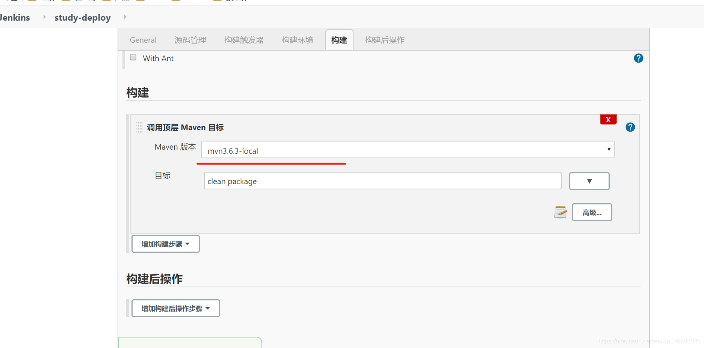
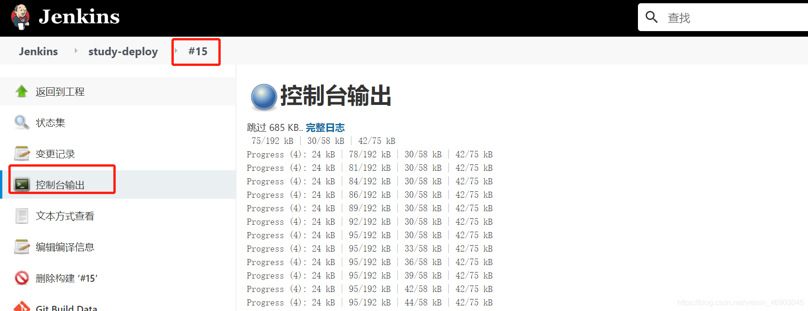
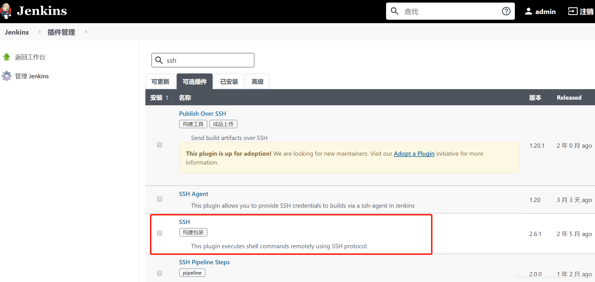
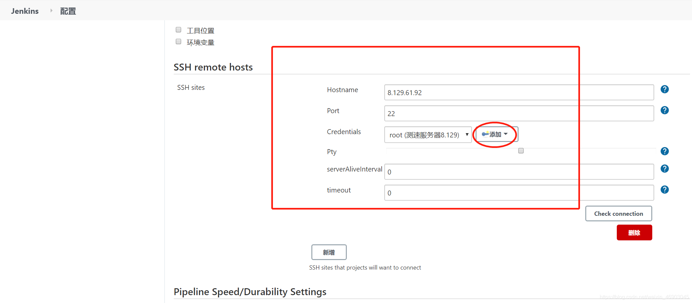
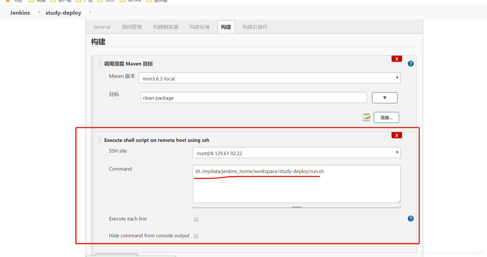

# Docker搭建genkins


## 安装jenkins

```shell

docker run -p 8080:8080 -p 50000:50000 --name jenkins \
-u root \
--mount src=jenkins_home,target=/var/jenkins_home \
-d jenkins/jenkins:lts
```
访问 ip:8080

查看安装密码

```
docker exec -it jenkins cat /var/jenkins_home/secrets/initialAdminPassword
```

依据安装向导完成安装。


## 配置maven环境
进入全局工具配置

点击新增maven，指定maven的安装路径。（ 因为jenkins是docker容器，所以需要把maven目录复制到jenkins的容器内。） [maven需要指定阿里云镜像](https://zhuanlan.zhihu.com/p/71998219)


## 构建jar包
新建任务，选择构建一个自由风格的软件项目

指定源码仓库。 (点击添加，创建凭证)

配置构建，指定maven

点击运行构建。


点击进入构建版本，查看控制台输出

## 运行部署
先安装ssh插件，安装后重启jenkins使插件生效。

配置ssh

新增构建，指定shell脚本,  运行构建。(shell脚本包含jar服务器启动逻辑)


## 参考
- [genkins中文文档](https://www.jenkins.io/zh/doc/)
- [使用genkins打包jar](https://mp.weixin.qq.com/s/tQqvgSc9cHBtnqRQSbI4aw)

