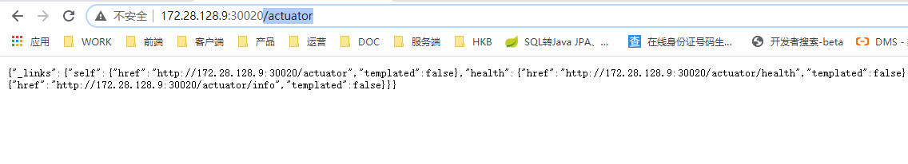

# K8s 部署springboot应用


## 打包Docker镜像并推送到Docker Hub

提前准备一个最简单的springboot 的jar包。然后参考下文把jar包推送到docker Hub.

 [镜像推送到Docker Hub](..\docker\push_to_docker_hub.md) 


## 创建Deployment

docker镜像上传docker hub吼，我们就可以写k8s的部署文件了。

```shell
#创建deployment
kubectl create deployment springboot-k8s-demo --image=zhoushen100/springboot-k8s-demo:1.0 --dry-run=client -o=yaml > deployment.yaml

echo --- >> deployment.yaml

#创建nodeport模式的servcie
#nodeport模式可以直接通过节点暴露的端口，访问服务（演示方便）
kubectl create service nodeport springboot-k8s-demo --tcp=8080:8080 --dry-run=client -o=yaml >> deployment.yaml
```


## 部署Deployment

```shell
#部署
kubectl apply -f deployment.yaml
```


## 查看结果

查看结果为runing。

```shell
[vagrant@master-node ~]$ kubectl get pods
NAME                        READY   STATUS    RESTARTS   AGE
k8s-demo2-7b7b9dc99-qfs26   1/1     Running   0          30m
nginx-6799fc88d8-4wt88      1/1     Running   0          3h36m
nginx-6799fc88d8-dcqzr      1/1     Running   0          4h39m

```

查看service, 对外暴露端口 30020

```shell
[vagrant@master-node ~]$ kubectl get svc
NAME         TYPE        CLUSTER-IP      EXTERNAL-IP   PORT(S)          AGE
k8s-demo2    NodePort    10.10.209.10    <none>        8080:30020/TCP   31m
kubernetes   ClusterIP   10.10.0.1       <none>        443/TCP          4h44m
nginx        NodePort    10.10.133.109   <none>        80:32603/TCP     4h19m

```

使用 http://<集群任意工作节点>:30020/actuator 访问查看结果

