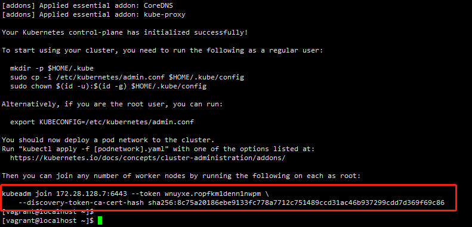
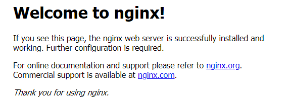

# 使用kubeadm搭建K8s 1.20x学习环境

使用官方推荐的kubeadm搭建k8s学习环境。


## 服务器准备

准备至少2台Centos8环境的服务器，一台用于部署Master（控制平面）、一台用于部署工作节点。

可以用vagrant在本地起两台虚拟机 ，参考 [使用vagrant+virtualBox创建Centos8虚拟机](vagrant_java_env.md)

|                      |              |                      |
| -------------------- | ------------ | -------------------- |
| Master （控制平面）  | 172.28.128.7 | Centos8 2core 2G RAM |
| Node-1 （工作节点）  | 172.28.128.9 | Centos8 2core 2G RAM |
| Node-2  （工作节点） | 172.28.128.8 | Centos8 2core 2G RAM |


## 服务器设置

```shell
#关闭setenforce
sudo setenforce 0
sudo sed -i 's/^SELINUX=enforcing$/SELINUX=permissive/' /etc/selinux/config

#关闭防火墙
sudo systemctl stop firewalld
sudo systemctl disable firewalld

#关闭swap
sudo swapoff -a

#注释掉 /swapfile 那一行
sudo vim /etc/fstab
```


## 安装docker

这里安装19.03.15版本的docker。因为这是 k8s 1.20.x 支持的最大版本。 

```sh
#安装
sudo yum install -y yum-utils

sudo yum-config-manager \
    --add-repo \
    https://download.docker.com/linux/centos/docker-ce.repo
   
sudo yum -y install docker-ce-19.03.15 docker-ce-cli-19.03.15 containerd.io

#设置中国镜像
sudo mkdir -p /etc/docker

sudo tee /etc/docker/daemon.json <<-'EOF'
{
  "registry-mirrors": ["https://9cpn8tt6.mirror.aliyuncs.com"]
}
EOF

sudo systemctl daemon-reload

#启动
sudo systemctl enable docker
sudo systemctl start docker    
```


## 安装kubelet kubeadm kubectl

安装并启动

```sh

cat <<EOF | sudo tee /etc/yum.repos.d/kubernetes.repo
[kubernetes]
name=Kubernetes
baseurl=https://mirrors.aliyun.com/kubernetes/yum/repos/kubernetes-el7-x86_64/
enabled=1
gpgcheck=1
repo_gpgcheck=1
gpgkey=https://mirrors.aliyun.com/kubernetes/yum/doc/yum-key.gpg https://mirrors.aliyun.com/kubernetes/yum/doc/rpm-package-key.gpg
EOF

sudo yum install -y kubelet kubeadm kubectl --disableexcludes=kubernetes

sudo systemctl enable kubelet

sudo systemctl start kubelet
```

## 安装master节点

```sh
#先拉取镜像， --image-repository 指定阿里云镜像代理。
sudo kubeadm config images pull --image-repository registry.aliyuncs.com/google_containers

#安装
# --apiserver-advertise-address 改成master节点ip
# --service-cidr 指定service分配的ip段
# --pod-network-cidr 指定pod分配的ip段
sudo kubeadm init --kubernetes-version=1.20.1  \
--apiserver-advertise-address=172.28.128.7   \
--image-repository registry.aliyuncs.com/google_containers  \
--service-cidr=10.10.0.0/16 --pod-network-cidr=10.122.0.0/16

```

初始化成功结果



按提示操作 （同时记录红框内容，用于添加工作节点用。）

```shell
  mkdir -p $HOME/.kube
  sudo cp -i /etc/kubernetes/admin.conf $HOME/.kube/config
  sudo chown $(id -u):$(id -g) $HOME/.kube/config
```

顺便运行一下，让kubectl可以自动填充命令。

```shell
source <(kubectl completion bash) && echo 'source <(kubectl completion bash)' >> ~/.bas
```

查看master节点信息。此时 master-node是NotReady。需要安装CNI pod-network

```shell
[vagrant@localhost ~]$ kubectl get node
NAME          STATUS     ROLES                  AGE     VERSION
master-node   NotReady   control-plane,master   2m25s   v1.20.4
```

## 安装 CNI 网络插件

这里我们使用calico

```shell
kubectl apply -f https://docs.projectcalico.org/manifests/calico.yaml
```

运行完成之后，等待calico pod 变成Running

```shell
[vagrant@master-node ~]$ kubectl get pod --all-namespaces
NAMESPACE     NAME                                       READY   STATUS    RESTARTS   AGE
kube-system   calico-kube-controllers-69496d8b75-k5g74   1/1     Running   0          81m
kube-system   calico-node-6fgfl                          1/1     Running   0          80m
kube-system   calico-node-b5gdb                          0/1     Running   0          81m
kube-system   calico-node-z8zvk                          1/1     Running   0          22m
kube-system   coredns-7f89b7bc75-8wck4                   1/1     Running   0          83m
kube-system   coredns-7f89b7bc75-r6k6f                   1/1     Running   0          83m
kube-system   etcd-master-node                           1/1     Running   0          84m
kube-system   kube-apiserver-master-node                 1/1     Running   0          84m
kube-system   kube-controller-manager-master-node        1/1     Running   0          84m
kube-system   kube-proxy-69zbm                           1/1     Running   0          80m
kube-system   kube-proxy-s5685                           1/1     Running   0          22m
kube-system   kube-proxy-wvkx5                           1/1     Running   0          83m
kube-system   kube-scheduler-master-node                 1/1     Running   0          84m
```


## 添加工作节点


首先按照前述文档操作步骤， 操作至 **安装kubelet kubeadm kubectl** 步骤即可。


接着设置工作节点名称, 我这里设置成node-1

```shell
sudo hostnamectl set-hostname node-1
```

设置工作节点host

```shell
sudo vi /etc/hosts
添加一条
<本机ip> node-1
```

执行节点加入命令(**安装master节点完成时提示的节点加入命令**)

```shell
kubeadm join 172.28.128.7:6443 --token wnuyxe.ropfkm1denn1nwpm \
    --discovery-token-ca-cert-hash sha256:8c75a20186ebe9133fc778a7712c751489ccd31ac46b937299cdd7d369f69c86
```

成功提示


去master节点上运行，可以看到mode-1 ready

```shell
[vagrant@localhost ~]$ kubectl get nodes
NAME          STATUS   ROLES                  AGE   VERSION
master-node   Ready    control-plane,master   16m   v1.20.4
node-1        Ready    <none>                 98s   v1.20.4

```

至此，集群搭建完毕。

## 测试一下

集群搭建完毕之后， 我们简单安装个nginx服务试一下可不可以用。

```shell
 kubectl create deployment nginx --image=nginx
 kubectl create service nodeport nginx --tcp=80:80
```

查看nodeport模式，对外开发的端口为 32603

```shell
[vagrant@master-node ~]$ kubectl get svc
NAME         TYPE        CLUSTER-IP      EXTERNAL-IP   PORT(S)        AGE
kubernetes   ClusterIP   10.10.0.1       <none>        443/TCP        90m
nginx        NodePort    10.10.133.109   <none>        80:32603/TCP   66m

```

浏览器打开 <Node-1的ip>:32603 即可看到



## 其他


```sh
#重置安装环境，master和node均可运行。用于重新安装节点。
sudo kubeadm reset

#查看节点部署情况
kubectl get pod --all-namespaces -o wide

#查看日志
kubectl logs <pod名称>

#进入Pod容器
kubectl exec -it <pod名称> -- /bin/bash

#查看pod信息
kubectl describe node <pod名称>

```


## 参考

[k8s 集群之使用 kubeadm 在 Centos8 上部署 kubernetes 1.20](https://blog.csdn.net/qq_34596292/article/details/112131042)


