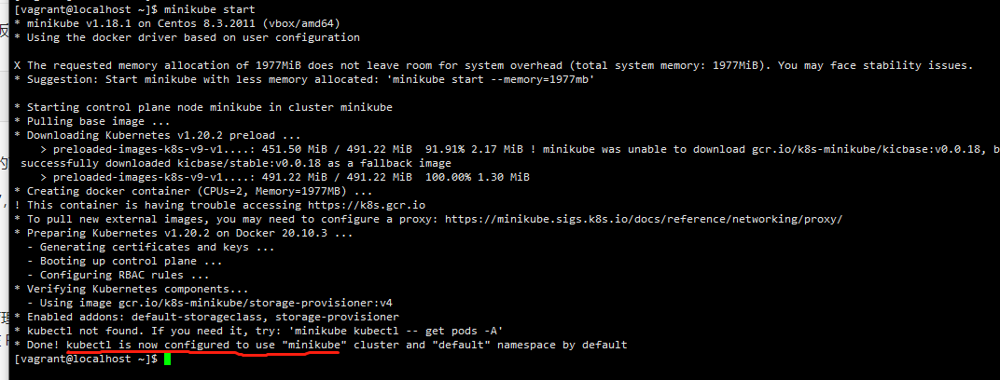

# 使用Minikube搭建K8s学习环境

MiniKube 单节点的k8s集群。一键安装， 用于本地开发学习k8s。


## 安装docker

```powershell
#安装
sudo yum install -y yum-utils
sudo yum-config-manager \
    --add-repo \
    https://download.docker.com/linux/centos/docker-ce.repo
sudo yum install -y docker-ce docker-ce-cli containerd.io
#启动
sudo systemctl start docker
```

参考： https://docs.docker.com/engine/install/centos/


## 修改docker镜像地址

```shell
##使用阿里云镜像加速器
[root@localhost ~]# mkdir -p /etc/docker
[root@localhost ~]# tee /etc/docker/daemon.json <<-'EOF'
{
  "registry-mirrors": ["https://9cpn8tt6.mirror.aliyuncs.com"]
}
EOF
[root@localhost ~]# systemctl daemon-reload
[root@localhost ~]# systemctl restart docker
```


## 安装minikube

```powershell
#把当前用户添加到docker组。
sudo usermod -aG docker $USER
newgrp docker
#安装
curl -LO https://storage.googleapis.com/minikube/releases/latest/minikube-linux-amd64
sudo install minikube-linux-amd64 /usr/local/bin/minikube
#设置容器
minikube config set driver docker 
#启动
minikube start

```



参考： https://minikube.sigs.k8s.io/docs/start/

## kubectl加入PATH

minikube安装完成后，直接运行kubectl 会找到不到，需要加入PATH。

```powershell
# 找到kubectl在哪里
sudo find / -name kubectl
# 复制到path目录
sudo cp /home/vagrant/.minikube/cache/linux/v1.20.2/kubectl /usr/bin/
```


## 访问Dashboard

```powershell
#启动dashboard
minikube dashboard --url &

#开放外部访问
kubectl proxy  --port=8001 --address='0.0.0.0' --accept-hosts='.*' &
```


