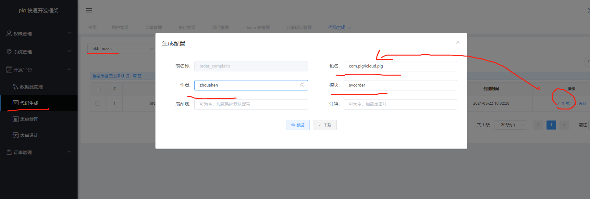
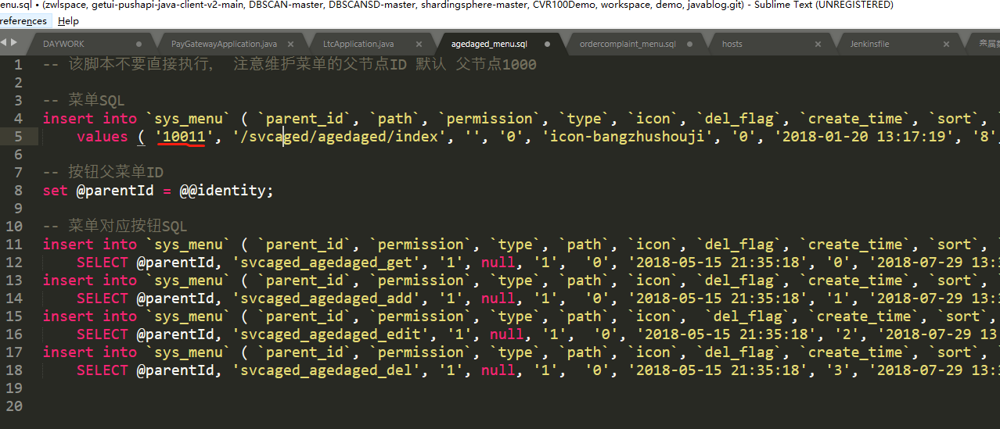
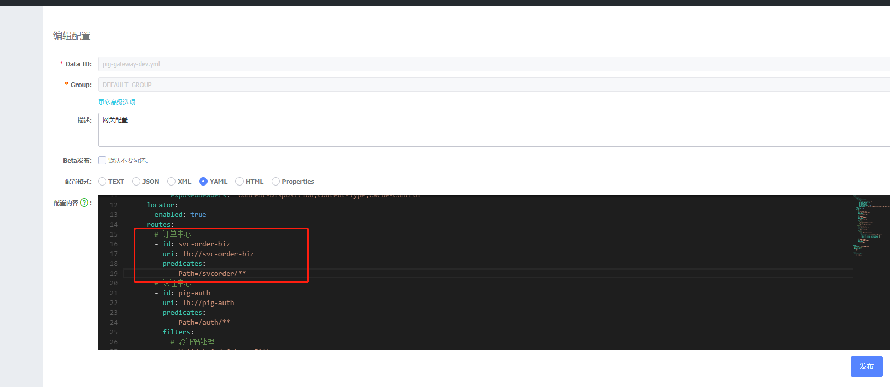
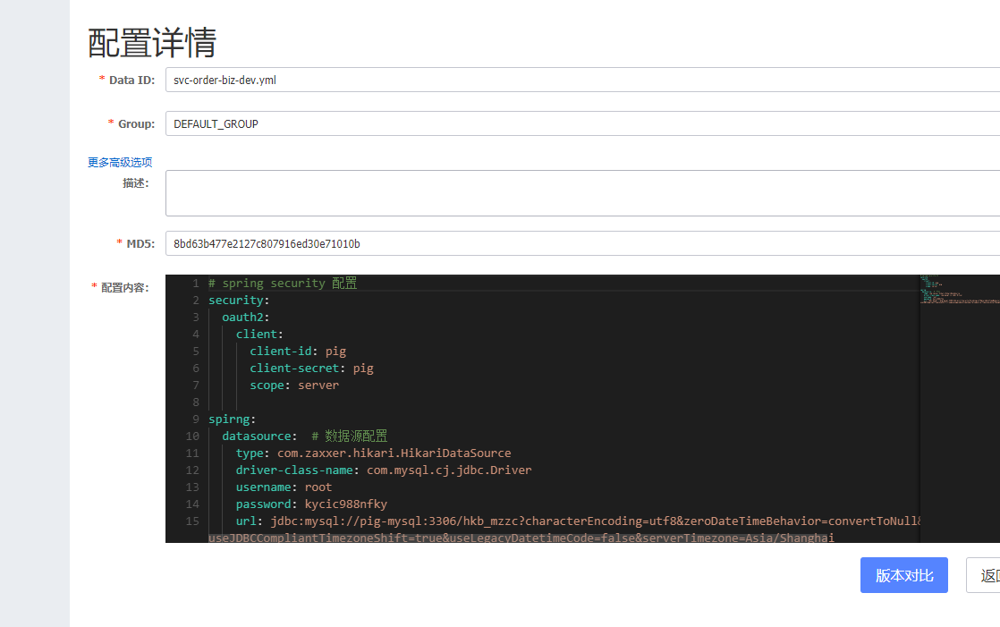
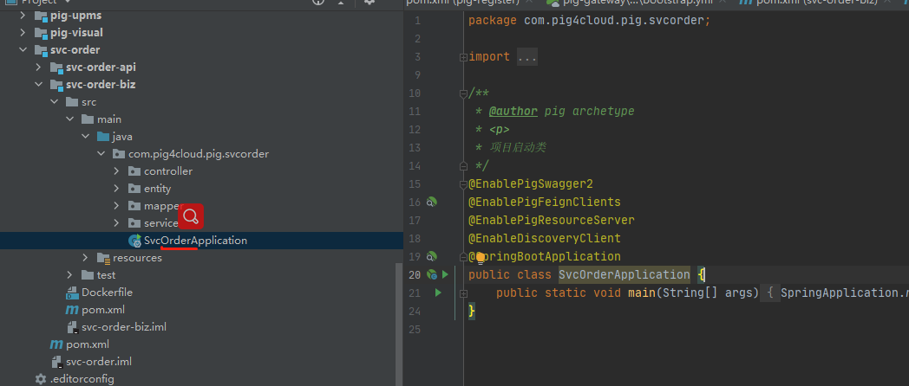

# Pig4Cloud添加微服务与CRUD


## 添加微服务

cmd运行(只能cmd, powershell不行..). 修改artifactId和package.

目前已知bug:  生成后会导致pom文件乱码.

```
mvn archetype:generate ^
       -DgroupId=com.pig4cloud ^
       -DartifactId=svc-aged ^
       -Dpackage=com.pig4cloud.pig.svcaged ^
       -DarchetypeGroupId=com.pig4cloud.archetype ^
       -DarchetypeArtifactId=pig-gen ^
       -DarchetypeVersion=3.0.5 ^
       -DarchetypeCatalog=local
```

## 代码生成

启动代码生成模块 -> 添加数据源




生成代码的权限在导入数据的时候,记得修改父类菜单ID.



菜单导入完成后,  角色管理 -> 权限 -> 选择导入的菜单. 然后刷新才能看到左侧菜单显示出来了. 但是访问的时候依然会没权限,需要重新登录.

## 修改微服务配置

添加服务网关配置.



添加微服务nacos配置。



启动类名称改成跟服务挂钩的名字。比如这里 svcorderApplication. 然后右键create run configuration创建启动. 然后就可以启动了.




