# IDEA 必装插件

> 一些常用的插件,用来提升java的开发效率,包括代码检测 代码生成 等.

### Alibaba Java Coding Guidelines

阿里巴巴《Java 开发手册》配套插件，可以实时检测代码中不符合手册规约的地方，助你码出高效，码出质量。

- 当我们违反手册规约时，该插件会自动检测并进行提示；

- 同时提供了一键检测所有代码规约情况和切换语言的功能；

- 如果你想修改某条规约的检测规则的话，可以通过设置的`Editor->Inspections`进行修改。

### Maven Helper 冲突解决

解决Maven依赖冲突的好帮手，可以快速查找项目中的依赖冲突，并予以解决！

- 我们可以通过`pom.xml`文件底部的`依赖分析`标签页查看当前项目中的所有依赖；

- 通过`冲突`按钮我们可以筛选出所有冲突的依赖，当前项目`guava`依赖有冲突，目前使用的是`18.0`版本；

- 选中有冲突的依赖，点击`Exclude`按钮可以直接排除该依赖；

- 同时`pom.xml`中也会对该依赖添加`<exclusion>`标签，是不是很方便啊！

### Free MyBatis plugin 代码生成

> 适用于使用mybatis的开发情景. 

- mapper 和 xml 之间跳转
  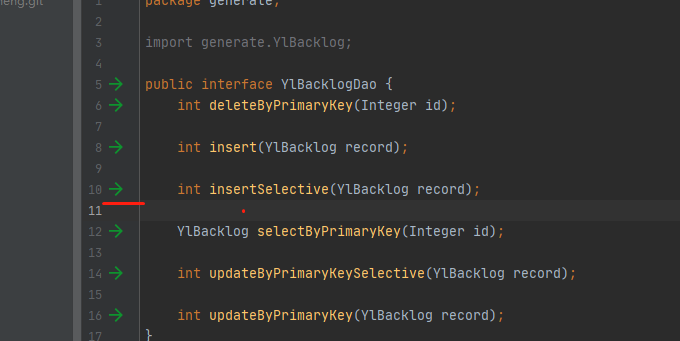

- 提供GUI界面生成Mapper, Entity, xml文件
  IDEA连接Mysql. 然后选中一个表,右键  mybatis-generator

  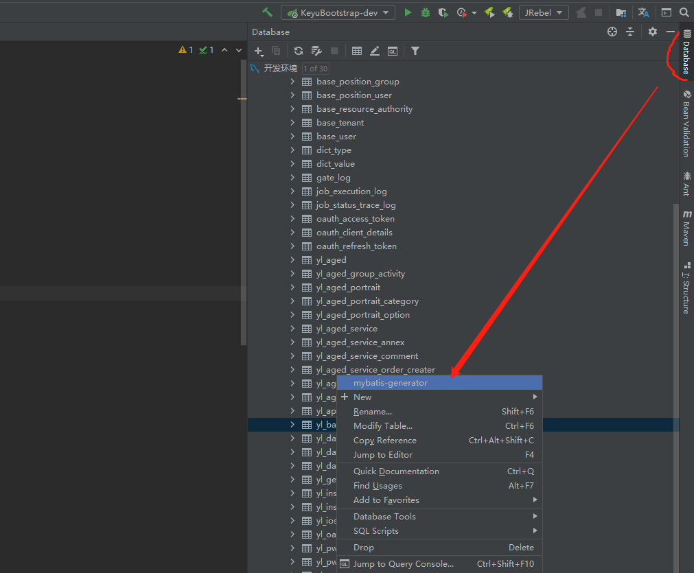

  勾选 user-lombox , user-swagger 其他根据需要修改.

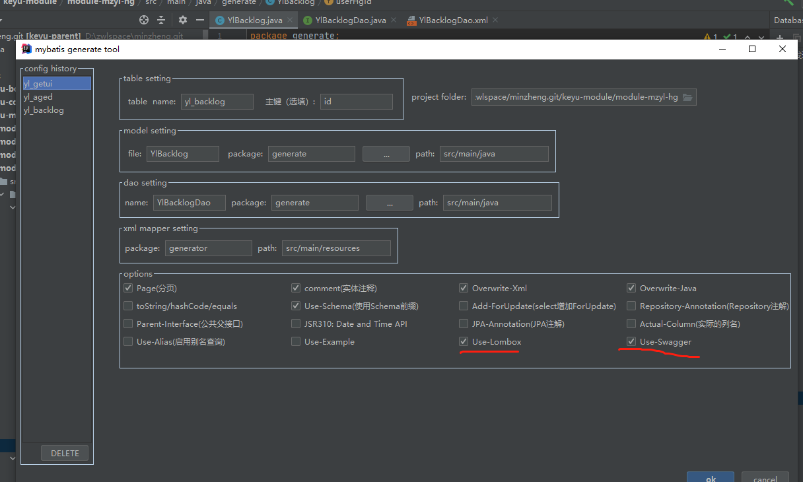

### Mybatis log plugin 日志人性化显示

插件使mybatis输出的日志转换为可读的sql语句.  插件目前已收费, 

[破解版插件下载地址]: https://github.com/Link-Kou/intellij-mybaitslog

如图手动安装

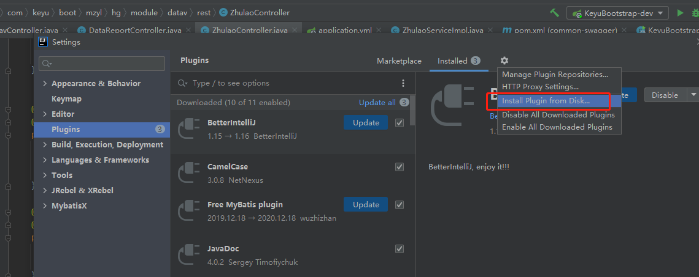

安装之后有数据库请求,会打印完整链接.

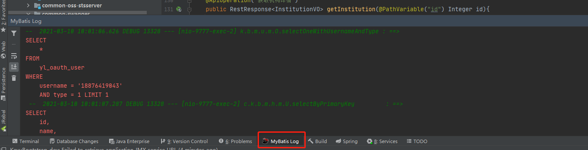

### restfultool 接口工具

可以一目了然的看到模块下的接口. 并且提供简单的请求工具.

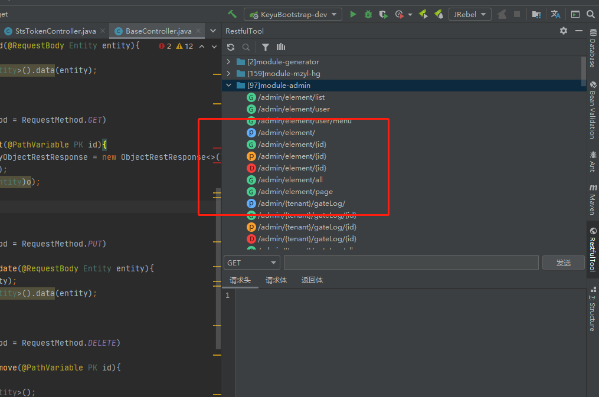

### EasyCode 代码生成

[EasyCode插件使用详解](https://hcshow.blog.csdn.net/article/details/105407780)

可以图形化的方式生成CRUD.  默认的CRUD是基于mybatis的. 

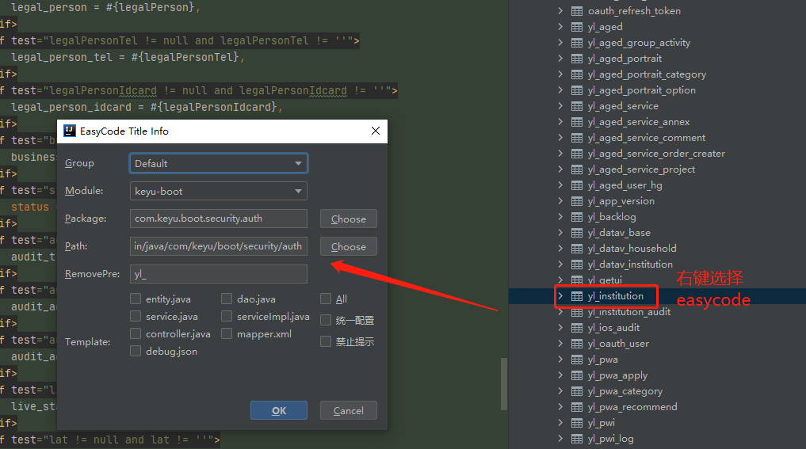

 但是这个插件可以在设置里面自定义模板,改成自己想要的.

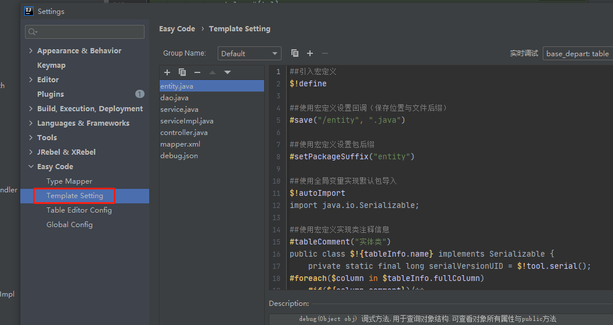

### JavaDoc 注释生成

选中方法, alt+insert 选择生成注释.

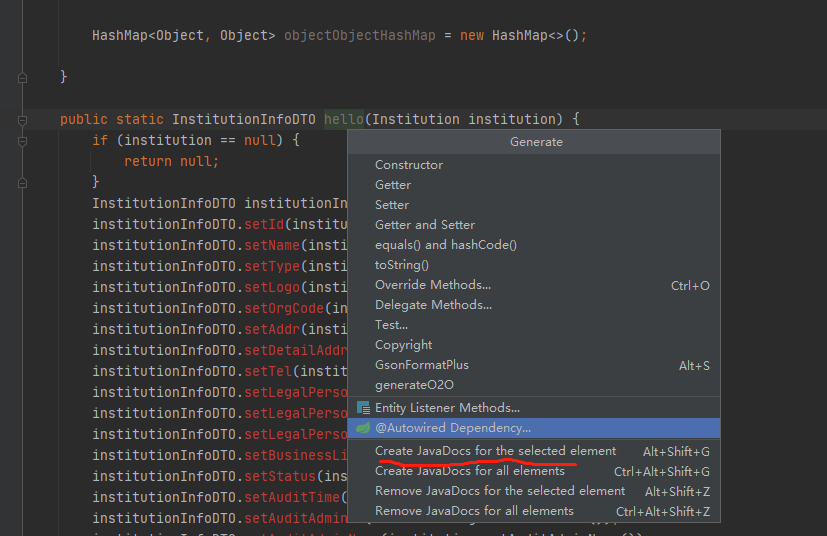

### **GenerateAllSetter** 一键生成set

一键调用一个对象的所有的set方法.  如图在vo上 **alt+enter**  然后选择 **Generate all setter with default value** 就会在下方生成所有set方法的调用.

[文档]: https://github.com/gejun123456/intellij-generateAllSetMethod

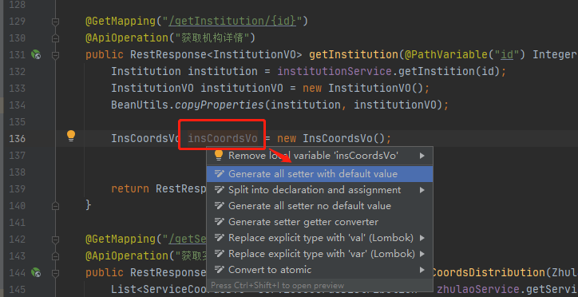

### GenerateO2O  对象属性拷贝

一键生成A类到B类的属性赋值.

假设我们要把 Institution的属性依次赋值给InstitutionInfoDTO. 首先写一个空函数

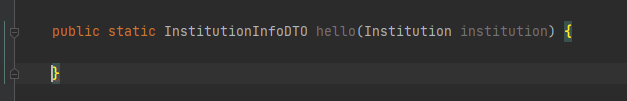

函数内按 alt+insert -> generateO2O

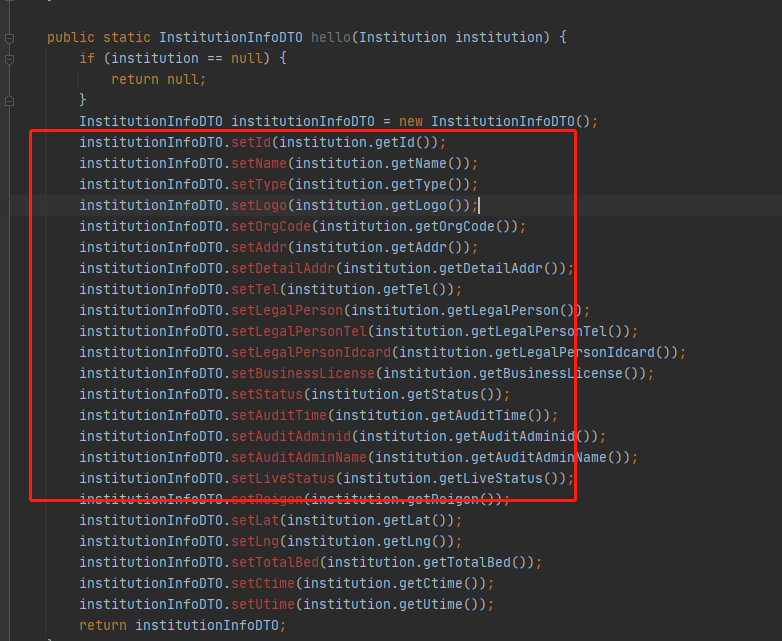

### GsonFormatPlus json转pojo

json转换成pojo， 当请求外部接口返回json，我们又需要创建一个对象来转换的时候使用。

### Java Bean to Json pojo转json

java pojo 转json

类上右键选择convertToJson, 会生成json内容到剪贴板， ctrl+v直接可以粘贴。

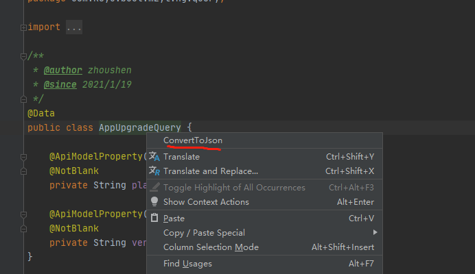

### String Manipulation 字符串转换

字符串转换,比如 下划线转驼峰.

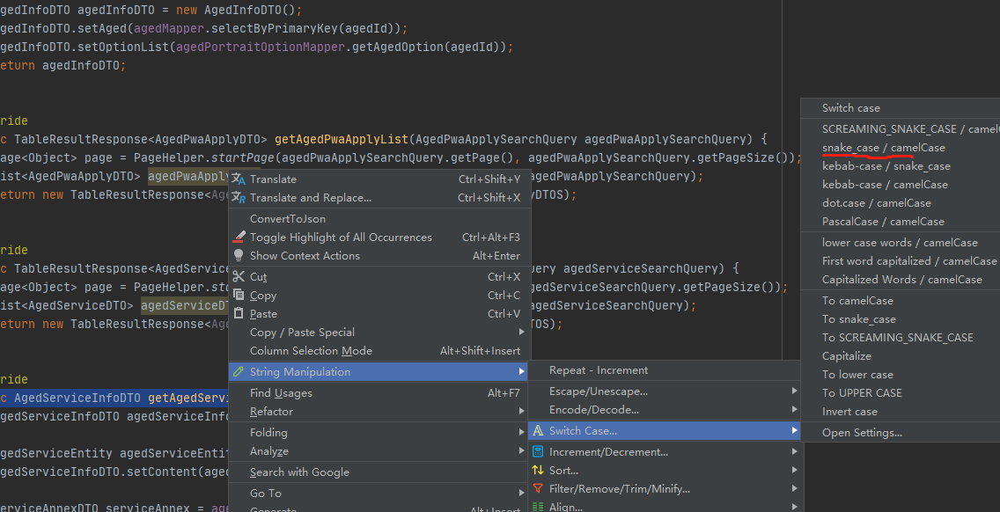

### Auto filling Java call arguments 自动填充方法参数

开发中，我们通常会调用其他已经编写好的函数，调用后需要填充参数，但是绝大多数情况下，传入的变量名称和该函数的参数名一致，当参数较多时，手动单个填充参数非常浪费时间。

该插件就可以帮你解决这个问题。

安装完该插件以后，调用一个函数，使用 Alt+Enter 组合键，调出 "Auto fill call parameters" 自动使用该函数定义的参数名填充。

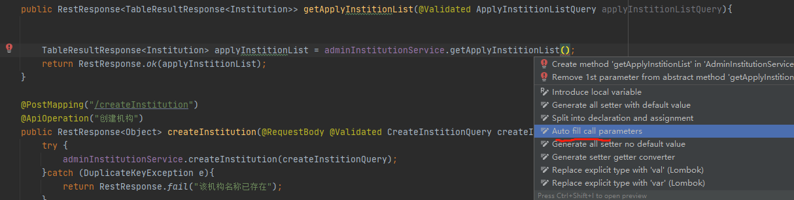

### **Translation 翻译**

可直接在IDEA内翻译的插件, 也可以输入中文翻译成英文并替换成变量.

[文档说明]: https://github.com/YiiGuxing/TranslationPlugin

> 默认google翻译,国内使用不了. 按文档切换成有道翻译(注册有道翻译key,按量收费的)

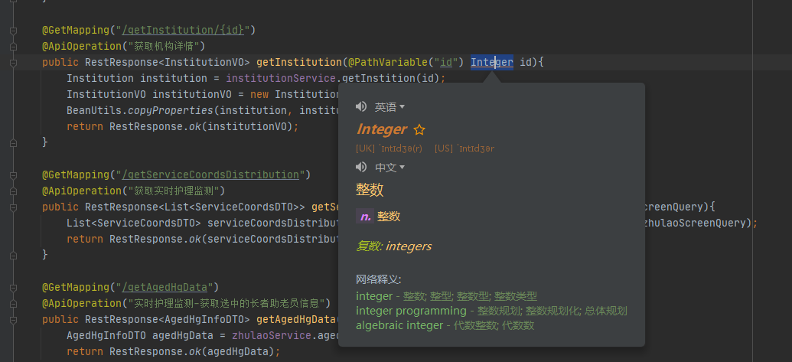

### CodeGlance 右侧代码缩略图

[参考这个文章设置](https://blog.csdn.net/ju_362204801/article/details/105504544)

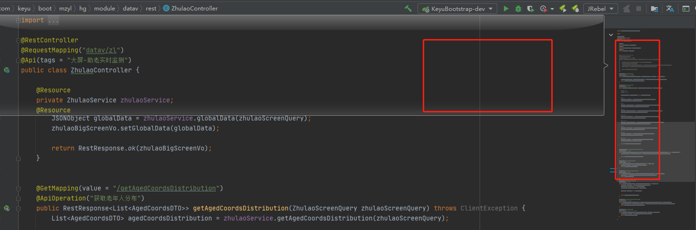

### Grep Console 控制台颜色输出

Idea console输出日志一大推，想要快速找到自己想要的类型日志，使用此插件可以快速定位到自己关注的类型日志，比如error，warn，自己也可以配置自己喜欢的颜色~

从settings进入，点击 other settings，可以配置自己喜欢的颜色提示，比如我只选择了默认~
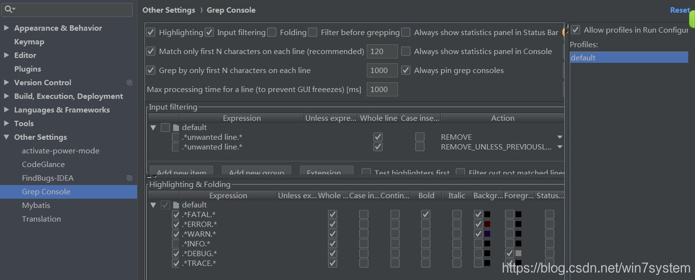

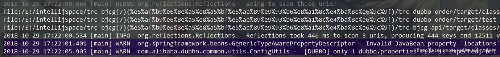

### SequenceDiagram:一键生成时序图

生成方法的调用堆栈. 方便调试阅读代码.

使用方法: 在方法上右键 => Sequence Diagram, 会生成一个调用时序图.

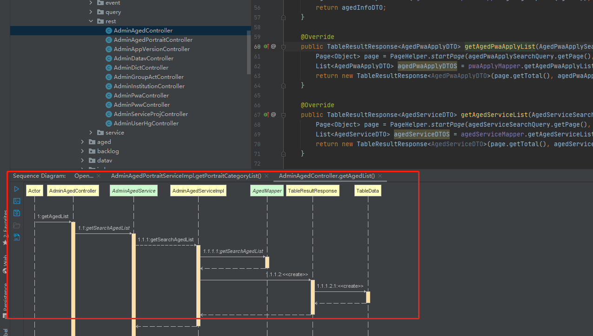

### Java Stream Debugger:Java8 Stream调试器

Stream API 让你的代码更加优雅，但是有一个缺点是代码更难阅读和理解，没关系，这个插件应该可以帮助到你！

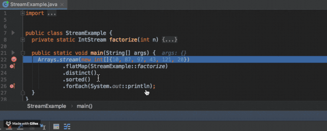

### Codota 辅助开发神器

- 支持智能代码自动提示，该功能可以增强 IDEA 的代码提示功能。

- 支持 JDK 和知名第三方库的函数的使用方法搜索，可以看到其他知名开源项目对该函数的用法。

- 基于AI学习的自动填充代码.

  

在类上右键 -> Get relevant examples 可以看使用案例.

点击Add可以搜索某个类的使用案例.

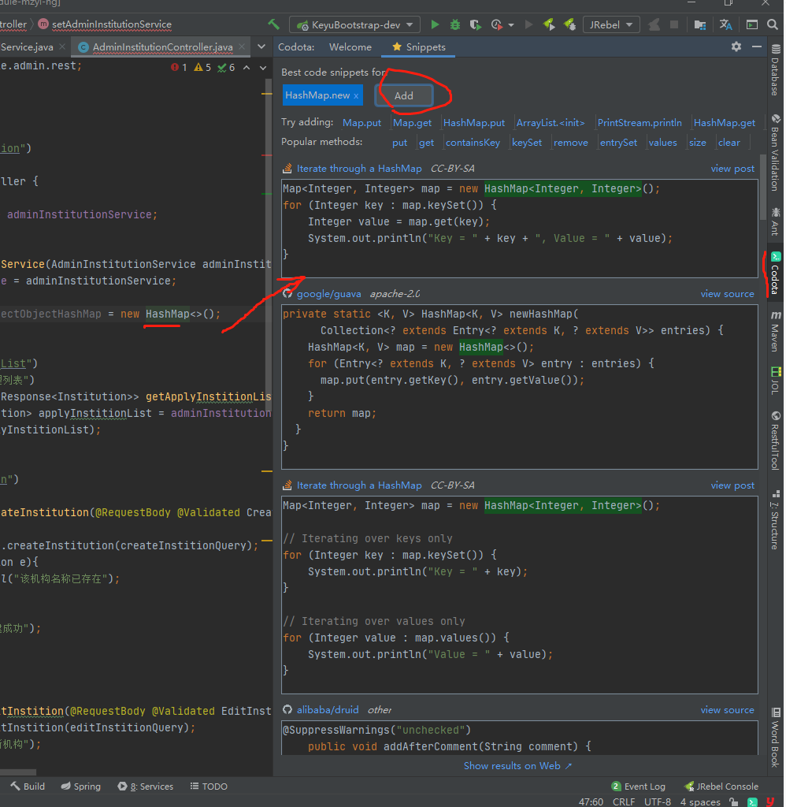

### 参考

https://zhuanlan.zhihu.com/p/99354824

http://www.macrozheng.com/#/reference/idea_plugins

https://blog.csdn.net/weixin_41846320/article/details/82697818