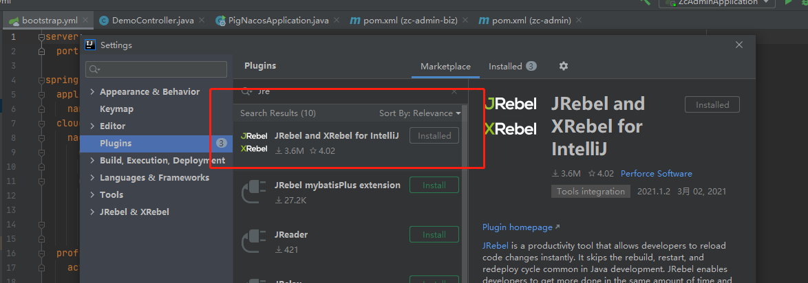
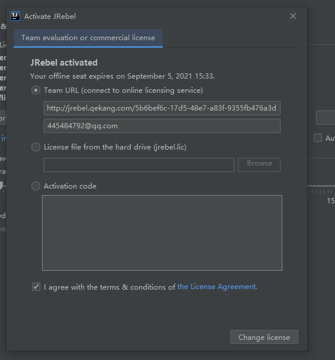
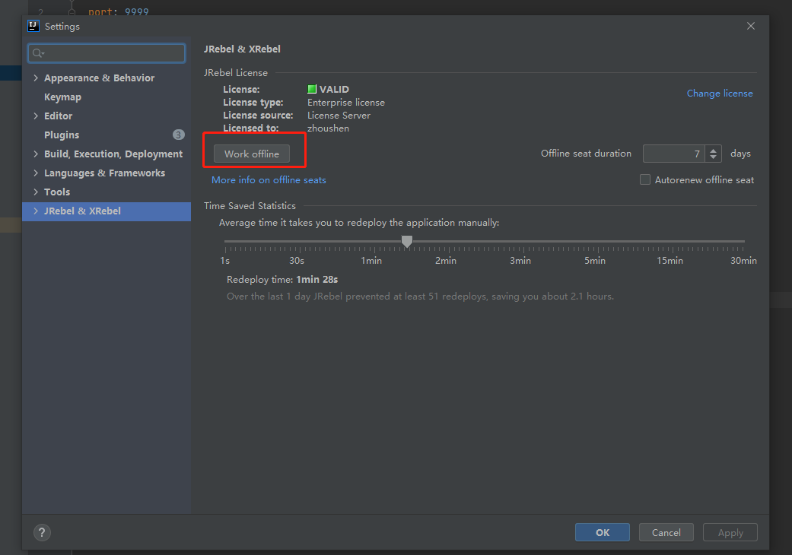
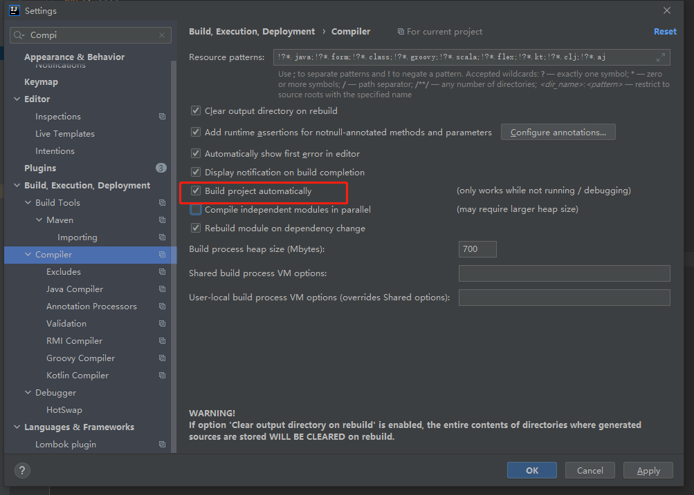
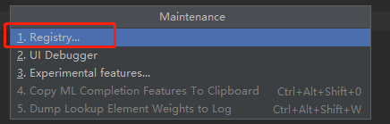
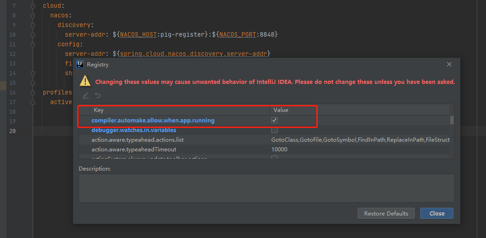
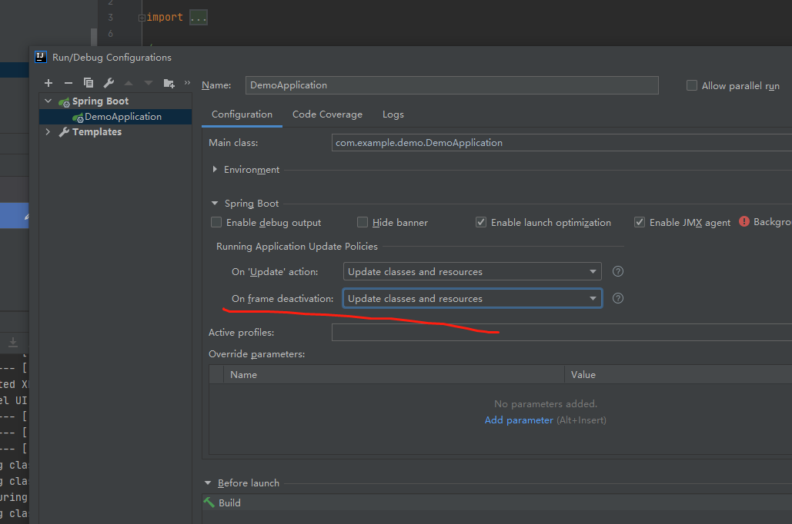

# 使用JRebel实现SpringBoot热部署

#效率# #IDEA#

## 安装JRebel插件

插件是收费的我们需要破解一下：

步骤1: 生成一个GUID：在线生成GUID地址 https://www.guidgen.com/

步骤2: http://jrebel.qekang.com/{GUID} 替换链接

步骤3: 打开jrebel 激活面板，Help-> JRebel -> Activation

## 使用配置

点击 Work offline

打开自动编译

ctrl + shift + alt + /

然后选中1

打钩选中自动编译

修改代码，按CTRL+F9 热编译项目（如果只改一个文件，可以在当前文件CTRL+SHIFT+F9 只热编译当前文件），就会触发jrebel的热部署，接着访问接口就能看到变更。

上面是手动触发热部署，也可以设置文件变更自动热部署。如下设置。设置后，不需要手动CTRL+F9编译项目。

