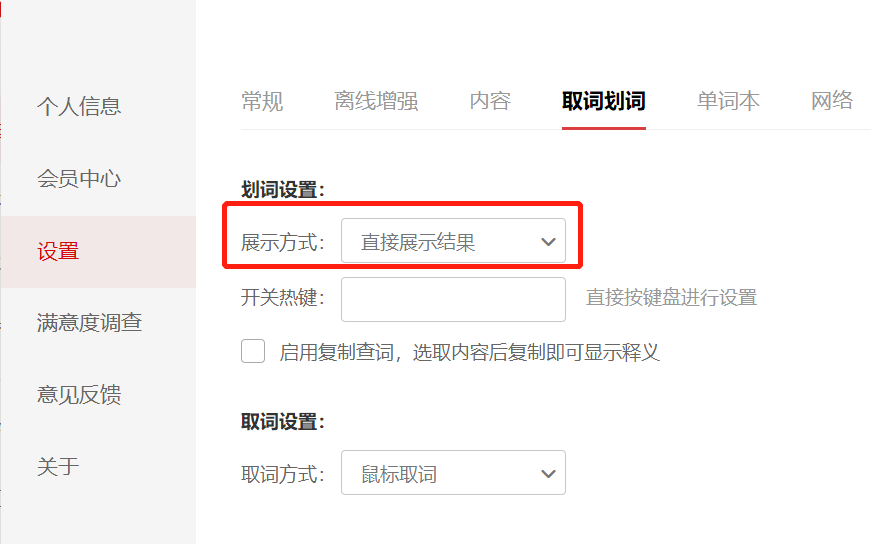
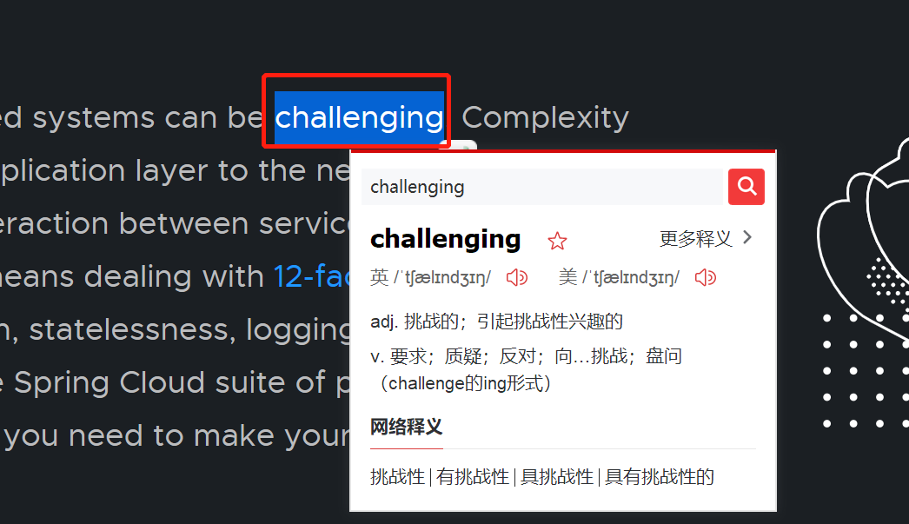
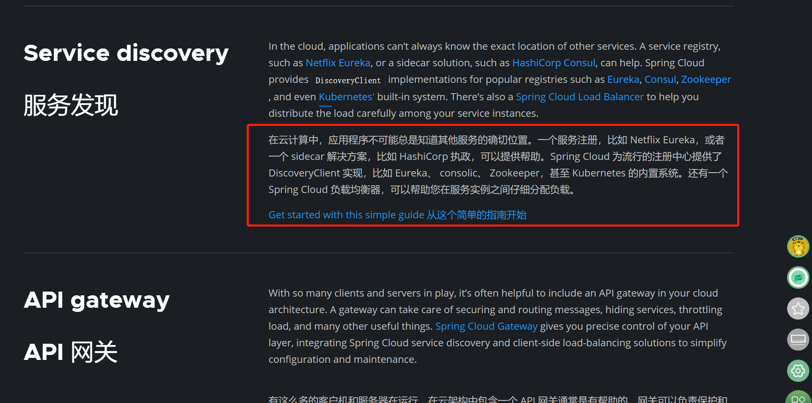

# 阅读英文文档翻译工具

> 
>
> 我一般在阅读英文技术文档的时候是结合使用以下三款翻译工具来提升阅读速度. 
>
> 网易有道词典\google彩云小译插件\google自带翻译插件. 
>
> 
>
> 阅读时,当看到不会的单词,直接双击单词 会触发 网易有道词典的翻译浮窗.
>
> 当觉得文档不是很理解的时候, 选中待翻译段落或者整页 右键选择彩云小译,页面自动展示中英文对照翻译.
>
>  也可以选择google翻译插件整页翻译然后通过右上角切换.
>
> 

## 网易有道词典

### 设置划词翻译

> 设置划词翻译, 当遇到不会的单词,双击单词即可自动展示翻译结果.

托盘图标右键 -> 开启划词翻译

托盘图标右键 -> 设置 -> 取词划词 -> 划词设置的展现方式为直接展示结果

设置之后网页上双击选择单词,即可自动展现翻译结果.

## Google 彩云小译插件

> 最大特点就是能中英对照翻译. 对于阅读英文技术文档很方便

在需要翻译的英文网页上右键 -> 启动彩云小译  即可中英文对照翻译

## Google浏览器自带翻译插件

> 英文网页上 右键 -> 翻译成中文 可把网页直接翻译成中文.
>
> 最大特点就是翻译质量相对于其他翻译引擎来说更精准.

