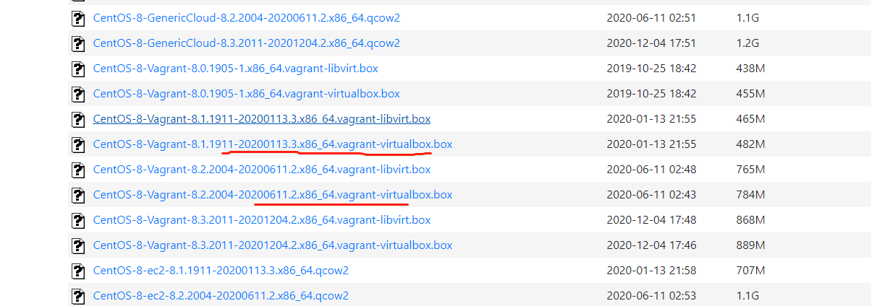
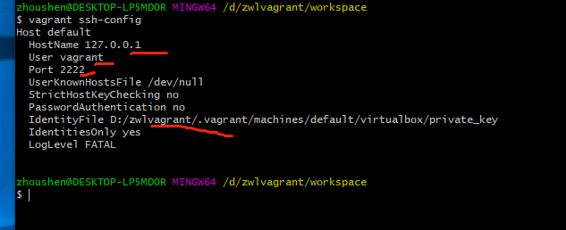
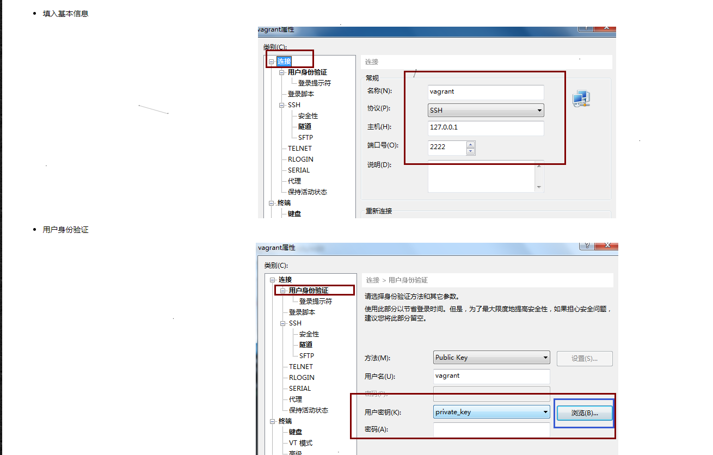

# 使用vagrant+virtualBox创建Centos8虚拟机

> 学习后端开发，必备Linux环境。本篇通过vagrant+virtualBox的方式来管理创建Linux。
>
> vagrant 是一个虚拟机管理工具。 通过vagrant控制virtual创建centos8.
>
> 提前了解vagrant有助于理解本文。 [征服诱人的Vagrant](https://www.cnblogs.com/hafiz/p/9175484.html)        [什么是vagrant](https://www.jianshu.com/p/0cabd5072b86)


## 下载安装

下载安装virtualbox https://www.virtualbox.org/wiki/Downloads

下载安装vagrant https://www.vagrantup.com/downloads.html

下载vagrant-virtualbox的centos8 镜像，进入 http://cloud.centos.org/centos/8/vagrant/x86_64/images/ 选择其一下载。



## 搭建流程

1.  打开cmd，安装vb-guest插件

   ```shell
   vagrant plugin install vagrant-vbguest
   ```

2. 把上一步下载的cent8镜像，添加给vagrant

   ```
   vagrant box add cs8java CentOS-8-Vagrant-8.1.1911-20200113.3.x86_64.vagrant-virtualbox.box
   ```


3.  初始化虚拟机， 运行后生成Vagrantfile文件

   ```
   vagrant init cs8java
   ```

4. 修改Vagrantfile文件

   ```
   config.vm.network "private_network", type:"dhcp"
   #同步目录指你的window电脑把目录共享给虚拟机。这样可以共享编辑文件。
   #设置同步目录(D:/vagrant-java/sharefolder改成你自己的目录)
   config.vm.synced_folder "D:/vagrant-java/sharefolder", "/sharefolder"
   
   #修改内存（可选）
    config.vm.provider "virtualbox" do |vb|
       # Display the VirtualBox GUI when booting the machine
       vb.gui = false
     
       # Customize the amount of memory on the VM:
       vb.memory = "2048"
       vb.cpus = 2
     end
   ```

   

5. 启动虚拟机 

   ```
   vagrant up
   ```

   等待....

6. 启动完毕进入虚拟机。

   ```
   vagrant ssh
   ```


## 使用SSH客户端连接虚拟机

> 使用vagrant ssh可以直接进入虚拟机。 但是一般我们是用ssh客户端，比如x-shell连接体验比较好。


1. 打开cmd 运行命令

   ```
   vagrant ssh-config
   ```
   
   

   2. 打开ssh客户端，根据上面的user port IdentityFile 进行设置。
      

   3. 设置之后即可进入虚拟机。

      


